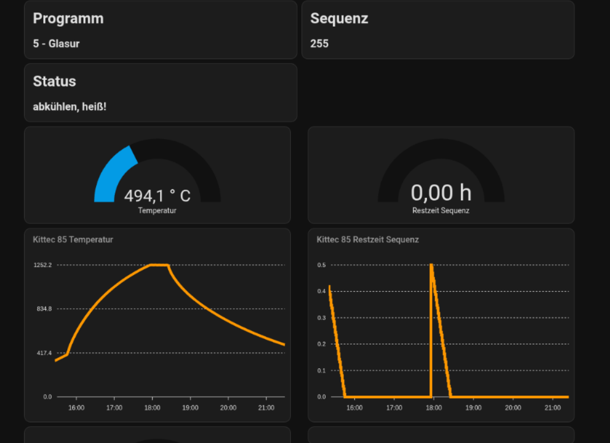

# Kittec 2 MQTT

This purpose of this scripts is to scrape the current data of my Pottery Kiln Kittec xxxx from the superwize.eu website and pass it to my MQTT so I can access it in Homeassistant.

It will currentlyx only **read** the actual data and is **not intended** to modify any setting of the oven/controller.

I owned a Kittec TC-75 and therefore only this devices is tested. I you have any other devices, please leet me know if it is working. If not we may find a was to get it working.


### Setup python venv

```
python3 -m venv ~/.venv-mqtt
. ~/.venv-mqtt/bin/activate 
pip install -r requirements.txt
```

### config


```
cp config.yml.example config.yml
$EDITOR config.yml
```
 
### single run

```
~/.venv-mqtt/bin/python kittec-scrape-py
```

###

run repeatingly


create a cronjob like this (run every minute)

```
* * * * * ~/.venv-mqtt/bin/python kittec-scrape-py
```

### Homeassistant Setup

Edit your configuration.yaml and add the lines below to your sensor section:
Adopt the topic as you configured before.

```
mqtt:
  sensor:
    - name: "kittec_85_temperature"
      state_topic: "kittec/85"
      value_template: '{{ value_json.temperature | float }}'
      unit_of_measurement: '° C'
    - name: "kittec_85_programm"
      state_topic: "kittec/85"
      value_template: '{{ value_json.programm | int }}'
    - name: "kittec_85_sequence"
      state_topic: "kittec/85"
      value_template: '{{ value_json.sequence | int }}'
    - name: "kittec_85_seconds"
      state_topic: "kittec/85"
      value_template: '{{ value_json.seconds | int }}'
```

We got the programm and the sequence as number. Sequence number 255 is set if the programm is done.

You may consider to setup a template sensor in Home Assistant to convert programm numbers to a string.
I personally use a automation for this:

```
alias: kittec-set-programmname
description: 
triggers:
  - trigger: state
    entity_id:
      - sensor.kittec_85_programm
    to: null
conditions: []
actions:
  - if:
      - condition: state
        entity_id: sensor.kittec_85_programm
        state: 1
    then:
      - action: input_select.select_option
        metadata: {}
        data:
          option: 1 - Trocknen
        target:
          entity_id: input_select.kittec_programmnames
  - if:
      - condition: state
        entity_id: sensor.kittec_85_programm
        state: 2
    then:
      - action: input_select.select_option
        metadata: {}
        data:
          option: 2 - Schrühbrand
        target:
          entity_id: input_select.kittec_programmnames
mode: single
```

A sample dashbaord may look like




